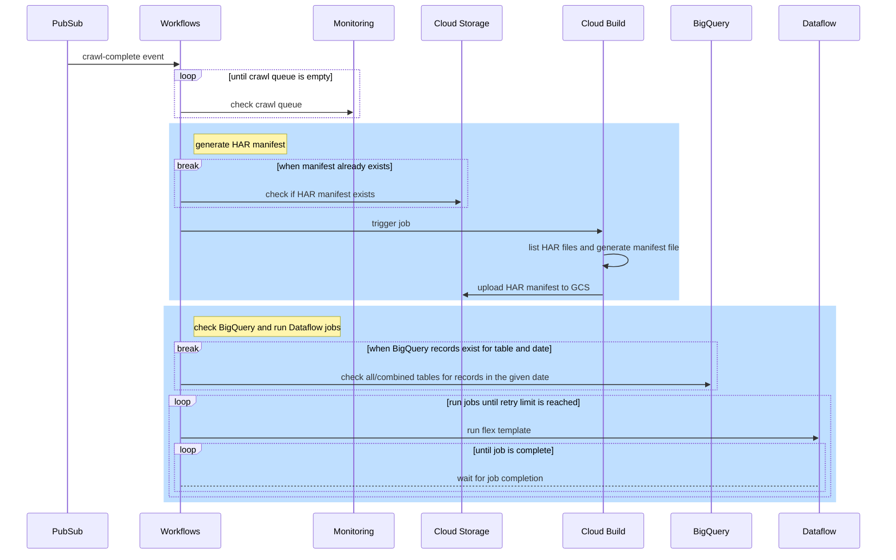
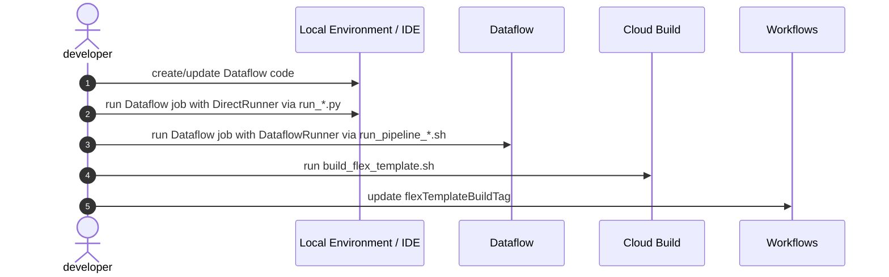
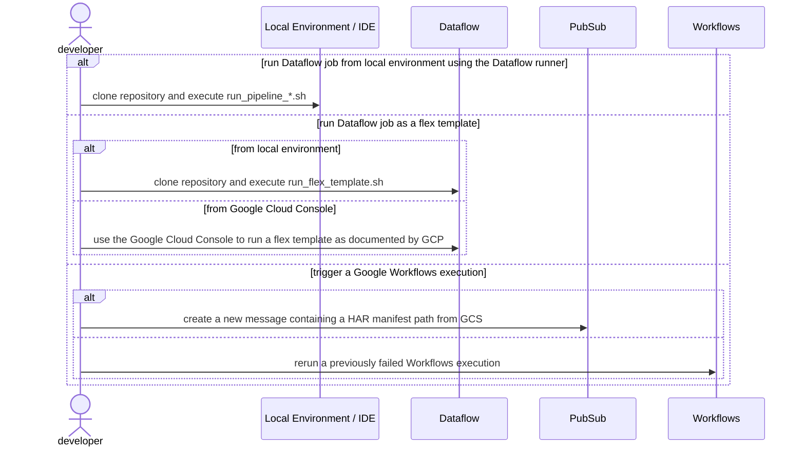
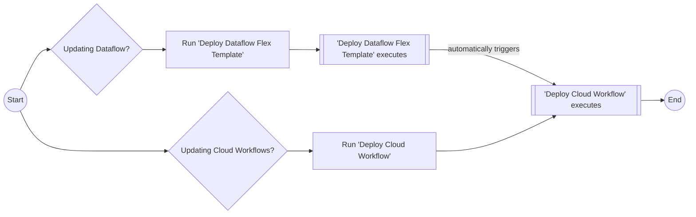
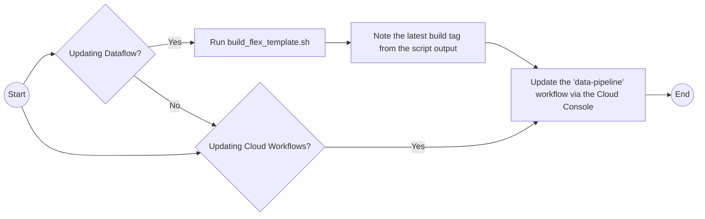

# data-pipeline
The new HTTP Archive data pipeline built entirely on GCP


- [Diagrams](#diagrams)
  * [GCP Workflows pipeline execution](#gcp-workflows-pipeline-execution)
  * [Development workflow](#development-workflow)
  * [Manually running the pipeline](#manually-running-the-pipeline)
- [Run the pipeline](#run-the-pipeline)
  * [Locally using the `run_*.sh` scripts](#locally-using-the-run_sh-scripts)
  * [Running a flex template from the Cloud Console](#running-a-flex-template-from-the-cloud-console)
  * [Publishing a Pub/Sub message](#publishing-a-pubsub-message)
  * [Pipeline types](#pipeline-types)
- [Inputs](#inputs)
  * [Generating HAR manifest files](#generating-har-manifest-files)
- [Outputs](#outputs)
- [Builds and Deployments](#builds-and-deployments)
  * [Build inputs and artifacts](#build-inputs-and-artifacts)
  * [To build and deploy manually](#to-build-and-deploy-manually)
- [Known issues](#known-issues)
  * [Data Pipeline](#data-pipeline)
    + [Temp table cleanup](#temp-table-cleanup)
    + [Streaming pipeline](#streaming-pipeline)
  * [Dataflow](#dataflow)
    + [Logging](#logging)
  * [Response cache-control max-age](#response-cache-control-max-age)
  * [New file formats](#new-file-formats)
  * [mimetypes and file extensions](#mimetypes-and-file-extensions)

<small><i><a href='http://ecotrust-canada.github.io/markdown-toc/'>Table of contents generated with markdown-toc</a></i></small>

## Introduction

This repo handles the HTTP Archive data pipeline, which takes the results of the monthly HTTP Archive run and saves this to the `httparchive` dataset in BigQuery.

There are currently two main pipelines:

- The `all` pipeline which saves data to the new `httparchive.all` dataset
- The `combined` pipline which saves data to the legacy tables. This processes both the `summary` tables (`summary_pages` and `summary_requests`) and `non-summary` pipeline (`pages`, `requests`, `response_bodies`....etc.)

The pipelines are run in Google Cloud Platform (GCP) and are kicked off automatically on crawl completion, based on the code in the `main` branch which is depolyed to GCP on each merge.

They can also be run locally, whereby the local code is uploaded to GCP for that particular run.

## Diagrams

### GCP Workflows pipeline execution



### Development workflow



### Manually running the pipeline



## Run the pipeline
Dataflow jobs can be triggered several ways:
- Locally using bash scripts (this is good to test uncommited code)
- From the Google Cloud Console (this is good to run commited code)
- By publishing a Pub/Sub message (this is good for the batch kicking off jobs when done)

### Locally using the `run_*.sh` scripts

This method is best used when developing locally, as a convenience for running the pipeline's python scripts and GCP CLI commands.

```shell
# run the pipeline locally
./run_pipeline_combined.sh
./run_pipeline_all.sh

# run the pipeline using a flex template
./run_flex_template all [...]
./run_flex_template combined [...]
```

### Running a flex template from the Cloud Console

This method is useful for running individual dataflow jobs from the web console since it does not require a development environment.

Flex templates accept additional parameters as mentioned in the GCP documentation below, while custom parameters are defined in `flex_template_metadata_*.json`

https://cloud.google.com/dataflow/docs/guides/templates/configuring-flex-templates#specify-options

https://cloud.google.com/dataflow/docs/guides/templates/using-flex-templates#run-a-flex-template-pipeline

Steps:
1. Locate the desired build tag (e.g. see `flexTemplateBuildTag` in the [data-pipeline.workflows.yaml](data-pipeline.workflows.yaml))
2. From the Google Cloud Console, navigate to the Dataflow > Jobs page
3. Click "CREATE JOB FROM TEMPLATE"
4. Provide a "Job name"
5. Change region to `us-west1` (as that's where we have most compute capacity)
6. Choose "Custom Template"
7. Browse to the template directory by pasting `httparchive/dataflow/templates/` into the `Template path`, ignoring the error saying this is not a file, and then clicking Browse to choose the actual file from that directory.
8. Choose the pipeline type (e.g. all or combined) for the chosen build tag (e.g. `data-pipeline-combined-2023-02-10_03-55-04.json` - choose the latest one for `all` or `combined`)
9. Click "SHOW OPTIONAL PARAMETERS" and provide an input for the "GCS input file"  pointing to the manifests file (e.g. `gs://httparchive/crawls_manifest/chrome-Jul_1_2023.txt` for Desktop Jul 2023 or `gs://httparchive/crawls_manifest/chrome-Jul_1_2023.txt` for Mobile for July 2023).
10. (Optional) provide values for any additional parameters
11. Click "RUN JOB"

### Publishing a Pub/Sub message

This method is best used for serverlessly running the entire workflow, including logic to
- block execution when the crawl is still running, by waiting for the crawl's Pub/Sub queue to drain
- skip jobs where BigQuery tables have already been populated
- automatically retry failed jobs

Publishing a message containing the crawl's GCS path(s) will trigger a GCP workflow.

``` shell
# single path
gcloud pubsub topics publish projects/httparchive/topics/crawl-complete --message "gs://httparchive/crawls/android-Nov_1_2022"

# multiple paths must be comma separated, without spaces
gcloud pubsub topics publish projects/httparchive/topics/crawl-complete --message "gs://httparchive/crawls/chrome-Feb_1_2023,gs://httparchive/crawls/android-Feb_1_2023"

```


### Pipeline types

Running the `combined` pipeline will produce summary and non-summary tables by default.
Summary and non-summary outputs can be controlled using the `--pipeline_type` argument.

```shell
# example
./run_pipeline_combined.sh --pipeline_type=summary

./run_flex_template.sh combined --parameters pipeline_type=summary
```

## Inputs

This pipeline can read individual HAR files, or a single file containing a list of HAR file paths.

```shell
# Run the `all` pipeline on both desktop and mobile using their pre-generated manifests.
./run_flex_template.sh all --parameters input_file=gs://httparchive/crawls_manifest/*-Nov_1_2022.txt

# Run the `combined` pipeline on mobile using its manifest.
./run_flex_template.sh combined --parameters input_file=gs://httparchive/crawls_manifest/android-Nov_1_2022.txt

# Run the `combined` pipeline on desktop using its individual HAR files (much slower, not encouraged).
./run_flex_template.sh combined --parameters input=gs://httparchive/crawls/chrome-Nov_1_2022
```

Note the `run_pipeline_combined.sh` and `run_pipeline_all.sh` scriprts uses the parameters in the scripts and these cannot be overrung with parameters. These are often useful for local testing of changes (local testing still results in the processing happening in GCP but using code copied from locally).

To save to different tables for testing, temporarily edit the `modules/constants.py` to prefix all the tables with `experimental_` (note the `experimental_parsed_css` is current production table so use `experimental_gc_parsed_css` instead for now).

### Generating HAR manifest files

The pipeline can read a manifest file (text file containing GCS file paths separated by new lines for each HAR file). Follow the example to generate a manifest file:

```shell
# generate manifest files
nohup gsutil ls gs://httparchive/crawls/chrome-Nov_1_2022 > chrome-Nov_1_2022.txt 2> chrome-Nov_1_2022.err &
nohup gsutil ls gs://httparchive/crawls/android-Nov_1_2022 > android-Nov_1_2022.txt 2> android-Nov_1_2022.err &

# watch for completion (i.e. file sizes will stop changing)
#   if the err file increases in size, open and check for issues
watch ls -l ./*Nov*

# upload to GCS
gsutil -m cp ./*Nov*.txt gs://httparchive/crawls_manifest/
```

## Outputs

- GCP DataFlow & Monitoring metrics - TODO: runtime metrics and dashboards
- Dataflow temporary and staging artifacts in GCS
- BigQuery (final landing zone)

## Builds and Deployments

[GitHub actions](.github/workflows/) are used to automate the build and deployment of Google Cloud Workflows and Dataflow Flex Templates. Actions are triggered on merges to the `main` branch, for specific files, and when other related GitHub actions have completed successfully.

- [Deploy Dataflow Flex Template](.github/workflows/deploy-dataflow-flex-template.yml) will trigger when files related to the data pipeline are updated (e.g. python, Dockerfile, flex template metadata). This will build and upload the new builds (where they _can_ be used) and update the [data-pipeline workflows YAML](data-pipeline.workflows.yaml) with the latest build tag (based on datetime) and open a PR to merge that (so the new builds _will_ be used by the batch).
- [Deploy Cloud Workflow](.github/workflows/deploy-cloud-workflow.yml) action will trigger when the [data-pipeline workflows YAML](data-pipeline.workflows.yaml) is updated, _or_ when the [Deploy Dataflow Flex Template](.github/workflows/deploy-dataflow-flex-template.yml) action has completed successfully.

PRs with a title of `Bump dataflow flex template build tag` should be merged providing they are only updating the build datetime in the `flexTemplateBuildTag`. Check it has not zeroed it out.

### Build inputs and artifacts

GCP's documentation for creating and building Flex Templates are [linked here](https://cloud.google.com/dataflow/docs/guides/templates/using-flex-templates#create_and_build_a_container_image)

The following files are used for building and deploying Dataflow Flex Templates:
- [.gcloudignore](.gcloudignore) excludes files from uploading to GCS for Cloud Build
- [build_flex_template.sh](build_flex_template.sh) a helper script to initiate the Cloud Build
- [cloudbuild.yaml](cloudbuild.yaml) is the configuration file for Cloud Build to create containers and template files in GCS (artifacts listed further below)
- [Dockerfile](Dockerfile) used to create the job graph and start the Dataflow job
- [flex_template_metadata_all.json](flex_template_metadata_all.json) and [flex_template_metadata_combined.json](flex_template_metadata_combined.json) define custom parameters to be validated when the template is run
- [run_flex_template.sh](run_flex_template.sh) a helper script to run a Flex Template pipeline

[Cloud Build](cloudbuild.yaml) is used to create Dataflow flex templates and upload them to Artifact Registry and Google Cloud Storage
- Cloud Build [linked here](https://console.cloud.google.com/cloud-build/builds?project=httparchive)
- Artifact Registry images [linked here](https://console.cloud.google.com/artifacts/docker/httparchive/us-west1/data-pipeline?project=httparchive)
- Flex templates in GCS [gs://httparchive/dataflow/templates](https://console.cloud.google.com/storage/browser/httparchive/dataflow/templates?project=httparchive)

### To build and deploy manually

The GitHub Actions can be triggered manually from the repository by following the documentation here for [Manually running a workflow](https://docs.github.com/en/actions/managing-workflow-runs/manually-running-a-workflow).



Alternatively, a combination of bash scripts and the Google Cloud Console can be used to manually deploy Cloud Workflows and Dataflow Flex Templates.



This can be started by makling changes locally and then running the `run_pipeline_all.sh` or `run_pipeline_combined.sh` scripts (after changing input paramters in those scripts). Local code is copied to GCP for each run so your shell needs to be authenticated to GCP and have permissions to run.

To save to different tables for testing, temporarily edit the `modules/constants.py` to prefix all the tables with `experimental_` (note the `experimental_parsed_css` is current production table so use `experimental_gc_parsed_css` instead for now).

## Logs

- Error logs can be seen in [Error reporting](https://console.cloud.google.com/errors;time=P30D?project=httparchive) GCP
- Jobs can be seen in the [Dataflow -> Jobs](https://console.cloud.google.com/dataflow/jobs?project=httparchive) screen of GCP.

## Known issues

### Data Pipeline

#### Temp table cleanup

Since this pipeline uses the `FILE_LOADS` BigQuery insert method, failures will leave behind temporary tables.
Use the saved query below and replace the dataset name as desired.

https://console.cloud.google.com/bigquery?sq=226352634162:82dad1cd1374428e8d6eaa961d286559

```sql
FOR field IN
    (SELECT table_schema, table_name
    FROM lighthouse.INFORMATION_SCHEMA.TABLES
    WHERE table_name like 'beam_bq_job_LOAD_%')
DO
    EXECUTE IMMEDIATE format("drop table %s.%s;", field.table_schema, field.table_name);
END FOR;
```

#### Streaming pipeline

Initially this pipeline was developed to stream data into tables as individual HAR files became available in GCS from a live/running crawl. This allowed for results to be viewed faster, but came with additional burdens. For example:
- Job failures and partial recovery/cleaning of tables.
- Partial table population mid-crawl led to consumer confusion since they were previously accustomed to full tables being available.
- Dataflow API for streaming inserts burried some low-level configuration leading to errors which were opaque and difficult to troubleshoot.

### Dataflow

#### Logging

> The work item requesting state read is no longer valid on the backend

This log message is benign and expected when using an auto-scaling pipeline
https://cloud.google.com/dataflow/docs/guides/common-errors#work-item-not-valid

### Response cache-control max-age

Various parsing issues due to unhandled cases

### New file formats

New file formats from responses will be noted in WARNING logs

### mimetypes and file extensions

Using ported custom logic from legacy PHP rather than standard libraries produces missing values and inconsistencies
